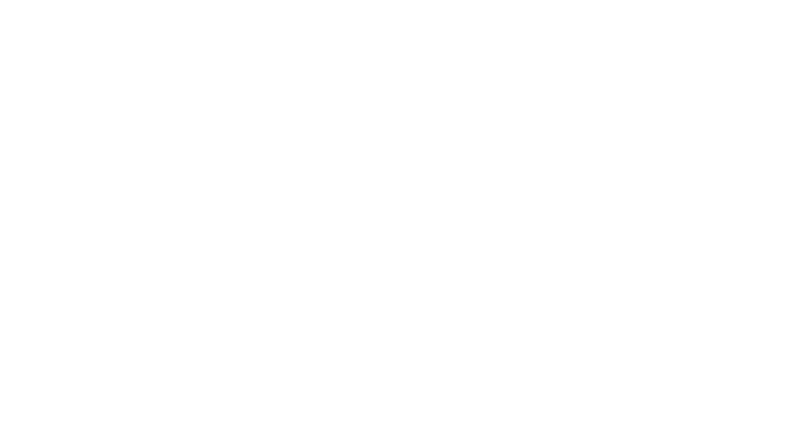

<div align="center">
  
  <h1 style="font-family: 'Bebas Neue', Arial, sans-serif; font-size: 2rem; letter-spacing: 2px; margin-bottom: 0;">UXDROID LINUX ENVIRONMENT</h1>
  <p><strong>Codename:</strong> <code>uxdroid</code></p>
</div>


---
  <h1 align="center"; style="font-family: 'Bebas Neue', Arial, sans-serif; font-size: 4rem; letter-spacing: 2px; margin-bottom: 0;">━━━━ Overview ━━━━</h1>

**uxdroid** is a powerful environment manager designed to bring full-fledged Ubuntu distributions directly to your Android device. It allows you to install pre-configured Linux environments complete with Desktop Environments (GUI), robust development tools, and standard Linux software. 
Because it leverages **PRoot** and **Termux**, uxdroid runs completely entirely in user-space. This means **no root access is required**, keeping your device secure and its warranty intact. 
> **Important:** Please review our [Disclaimer](md/disclaimer.md) and the official [Wiki](https://udroid-rc.gitbook.io/) before proceeding with the installation.


---
<h1 align="center"; style="font-family: 'Bebas Neue', Arial, sans-serif; font-size: 4rem; letter-spacing: 2px; margin-bottom: 0;">━━━ Installation Guide ━━━</h1>

We provide two main methods for installing uxdroid. Choose the one that best fits your workflow. For more advanced configurations and command-line arguments, refer to the [Advanced Usage Documentation](https://github.com/jfachriz/fs-manager-uxdroid/blob/main/README.md).
### Method 1: Automated One-Line Installer (Recommended)
To install the stable release of the `uxdroid` filesystem quickly, use the automated script. If you have a completely fresh installation of Termux, ensure your packages are updated first.


**For a fresh Termux environment:**
```bash
# Update local repositories and upgrade existing packages
apt update && apt upgrade -y

# Download and execute the automated installer script
. <(curl -Ls https://bit.ly/uxdroid-installer)
```


**For an existing, updated Termux environment:**
```bash
. <(curl -Ls https://bit.ly/uxdroid-installer)
```


### Method 2: Manual Installation via Git
If you prefer to manually install the manager tool and select your distribution parameters yourself, follow these steps:
```bash
# Update packages and install git
apt update && apt upgrade -y
apt install git -y

# Clone the repository and navigate into it
git clone https://github.com/jfachriz/fs-manager-uxdroid
cd fs-manager-uxdroid

# Run the local installation script
bash install.sh

# List Distro Data
uxdroid list

# Install your chosen distribution (Example: Ubuntu Jammy with XFCE4)
uxdroid install jammy:xfce4
```


<h1 align="center"; style="font-family: 'Bebas Neue', Arial, sans-serif; font-size: 4rem; letter-spacing: 2px; margin-bottom: 0;">━━━ Launching Desktop ━━━</h1>

Once the installation is complete, you can launch your Desktop Environment by following these steps:

1. Open the **Termux-X11**.
2. Inside Termux, execute the startup script:

```bash
bash startuxdroid.sh

# Or alternatively:
./startuxdroid.sh
```


---
<h1 align="center"; style="font-family: 'Bebas Neue', Arial, sans-serif; font-size: 4rem; letter-spacing: 2px; margin-bottom: 0;">━━━ Distribution Status ━━━</h1>

Below is the current support matrix for various Ubuntu releases. 
* **RAW** indicates a command-line interface (CLI) only base.
* **XFCE4, MATE, GNOME** indicate support for pre-configured Desktop Environments.
### Current Long Term Support (LTS) Releases
Stable, heavily tested environments recommended for most users.


| Distribution | XFCE4 | MATE | GNOME | RAW |
| :--- | :--- | :--- | :--- | :--- |
| [Ubuntu Resolute (26.04) LTS](https://docs.udroid.org/suites/ubuntu-26.04-lts) | - | - | - | ✔ |
| [Ubuntu Noble (24.04) LTS](https://docs.udroid.org/suites/ubuntu-24.04-lts) | - | - | - | ✔ |
| [Ubuntu Jammy (22.04) LTS](https://docs.udroid.org/suites/ubuntu-22.04-lts) | ✔ | ✔ | ✔ | ✔ |


### Non-LTS Releases
Bleeding-edge environments for users who need the latest packages and features.

| Distribution | XFCE4 | MATE | GNOME | RAW |
| :--- | :--- | :--- | :--- | :--- |
| [Ubuntu Questing (25.10)](https://docs.udroid.org/suites/ubuntu-25.10) | - | - | - | ✔ |
| [Ubuntu Plucky (25.04)](https://docs.udroid.org/suites/ubuntu-25.04) | - | - | - | ✔ |


### End of Life (EOL) Distros
These versions are no longer officially supported by upstream repositories and are provided as-is for archival or specific legacy testing.

| Distribution | XFCE4 | MATE | RAW |
| :--- | :--- | :--- | :--- |
| [Ubuntu Oracular (24.10)](https://docs.udroid.org/suites/ubuntu-24.10) | - | - | ✔ |
| [Ubuntu Mantic (23.10)](https://udroid-rc.gitbook.io/udroid-wiki/suites/ubuntu-23.04) | - | - | ✔ |
| [Ubuntu Lunar (23.04)](https://udroid-rc.gitbook.io/udroid-wiki/suites/ubuntu-23.04) | - | - | ✔ |
| [Ubuntu Kinetic (22.10)](https://udroid-rc.gitbook.io/udroid-wiki/suites/ubuntu-22.10) | - | - | ✔ |
| [Ubuntu Focal (20.04) LTS](https://docs.udroid.org/suites/ubuntu-20.04-lts) | ✔ | - | ✔ |
| [Ubuntu Impish (21.10)](https://udroid-rc.gitbook.io/udroid-wiki/suites/ubuntu-21.10) | ✔ | ✔ | ✔ |
| [Ubuntu Hirsute (21.04)](https://udroid-rc.gitbook.io/udroid-wiki/suites/ubuntu-21.04) | ✔ | - | ✔ |


---
<h1 align="center"; style="font-family: 'Bebas Neue', Arial, sans-serif; font-size: 4rem; letter-spacing: 2px; margin-bottom: 0;">━━━ Contributing ━━━</h1>

Contributions are what make the open-source community such an amazing place to learn, inspire, and create. We deeply appreciate any type of contribution, whether it is writing code, reporting bugs, or helping shape up the wiki documentation!
* Any changes to this repository's code should be submitted as a **Pull Request**.
* Please ensure your Pull Request includes a well-explained description of the changes or fixes made.


---
<h1 align="center"; style="font-family: 'Bebas Neue', Arial, sans-serif; font-size: 4rem; letter-spacing: 2px; margin-bottom: 0;">━━━ Miscellaneous ━━━</h1>

If you are interested in building custom Linux root filesystem tarballs from scratch rather than using our pre-compiled images, check out our companion tool: **[ux-cook](https://github.com/jfachriz/ux-cook)**.


---
<h1 align="center"; style="font-family: 'Bebas Neue', Arial, sans-serif; font-size: 4rem; letter-spacing: 2px; margin-bottom: 0;">━━━━ License ━━━━</h1>

Distributed under the **MIT License**.
Copyright © 2026 jfachriz